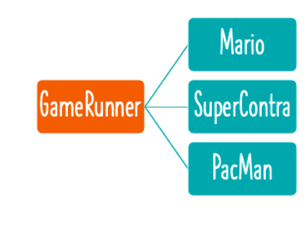
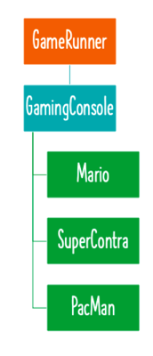

**Why is Coupling important?**
measure of how much work is involved in changing something.

**_We want to loose-coupling as much as possible._**
We want to be able to make functional changes with as less code changes as possible.

---

**Loose-coupling - interface**
bringing in a gamingConsole interface, the Game Runner class is disconnected from this specific game (Mario, SuperContram PacMan)
_The game Runner class is no longer coupled to a specific game._

**It is only coupled with a specific interface and therefore the game you are playing can be changed without changing the gameRunner class.**